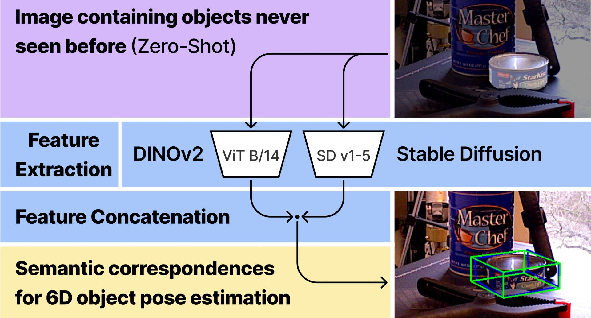
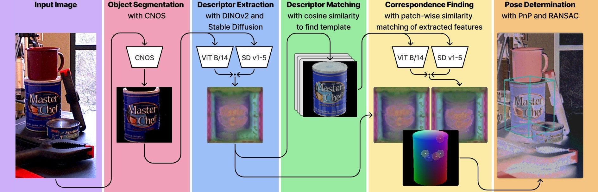

# ZS6D



In this repo ZS6D-SD-DINO is introduced, a novel approach of concatenating features from Stable Diffuison(SD) and DINOv2 to accomplish zero-shot 6D object pose estimation.

## Overview of the Pipeline:



CNOS segments the target object from the input image. Descriptors are
extracted using DINOv2 and SD, then concatenated. This descriptor is matched against a template database using cosine
similarity. From the matched template, descriptors are extracted using DINOv2 and SD, then concatenated. Patchwise
similarity matching of the extracted features establishes correspondences between the segmented input and the matched template. Finally, PnP and RANSAC are applied for the 6D object pose determination.

For more information, see: [ZS6D-SD-DINO Paper](zs6d_sd_dino_paper.pdf)


## Installation:
To setup the environment to run the code locally follow these steps:

```
conda env create -f environment.yml
conda activate zs6d_sd_dino
```

Follow installation guide of: https://github.com/Junyi42/sd-dino
```
cd external
conda install pytorch=1.13.1 torchvision=0.14.1 pytorch-cuda=11.6 -c pytorch -c nvidia
conda install -c "nvidia/label/cuda-11.6.1" libcusolver-dev
git clone git@github.com:Junyi42/sd-dino.git 
```
Important:
change folder name ```/sd-dino``` to ```/sd_dino```
```
cd sd_dino
pip install -e .
```
Add additional modules:

```
pip install tqdm==4.65.0
pip install timm==0.9.16
pip install matplotlib==3.8.3
pip install scikit-learn==1.4.1.post1
pip install opencv-python==4.9.0
pip install git+https://github.com/lucasb-eyer/pydensecrf.git@dd070546eda51e21ab772ee6f14807c7f5b1548b
pip install transforms3d==0.4.1
pip install pillow==9.4.0
pip install plyfile==1.0.3
pip install trimesh==4.1.4
pip install imageio==2.34.0
pip install pypng==0.20220715.0
pip install vispy==0.12.2
pip install pyopengl==3.1.1a1
pip install pyglet==2.0.10
pip install numba==0.59.0
pip install jupyter==1.0.0
```

Possible Installation problems:
1. ```cannot import name 'trunc_normal_' from 'utils' (unknown location)```
   Solution: Change filename utils in .cache location to utils_loc 
2. ```AttributeError: module 'PIL.Image' has no attribute 'LINEAR'```
   Solution: Replace Image.LINEAR with Image.BILINEAR

## Template rendering:
See:  [ZS6D_template_rendering](https://github.com/haberger/ZS6D_template_rendering) to generate templates from a object model to perform interference. 

## Template preparation:

Do the template generation with this command in the ZS6D folder: 

```python3 prepare_templates_and_gt_sd_dino.py```

Make sure that the templates are in the ```/templates``` folder.

For more information, see: https://github.com/PhilippAuss/ZS6D

## Testing:
After setting up the templates, you can run this file for an example of ZS6D-SD-DINO:

```test_zs6d_sd_dino.ipynb```


## Evaluation on BOP Datasets:

Add BOP dataset to ```/test``` folder


Run this file:

```evaluate_zs6d_bop_sd_dino.py```

For more information, see: https://github.com/PhilippAuss/ZS6D
